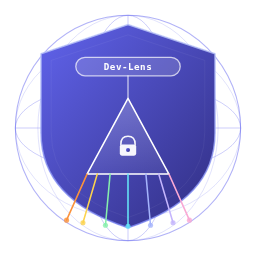
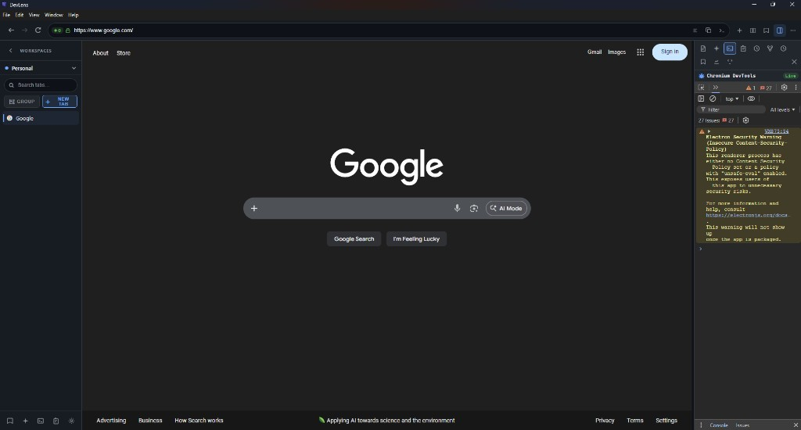
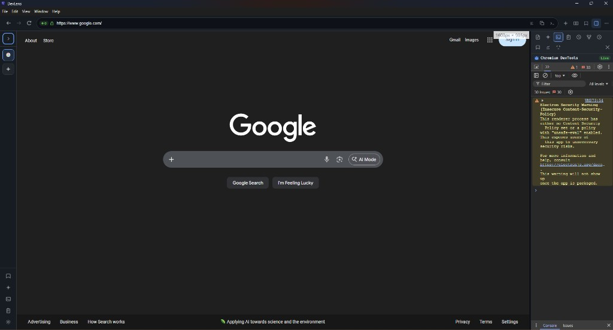

<p align="center">
  
</p>

<h1 align="center">Dev-Lens</h1>

<p align="center">
  A privacy-first desktop browser shell built with <strong>Electron</strong> and <strong>Angular</strong> — for developers and power users who want workspaces, fast in-app search, privacy controls, and dev tooling without constant context switching.
</p>

<p align="center">
  <!-- Visitor counter (increment on every page view) -->
  
  <!-- Latest release -->
  
  <!-- Total downloads across all releases -->
  
  <!-- Stars -->
  
  <!-- License -->
  
  <!-- Node version -->
  
</p>

<p align="center">
  <a href="https://github.com/JaredScar/DevLens/releases/latest">
    
  </a>
</p>

---

## Screenshots

<table>
  <tr>
    <td align="center" width="50%">
      <b>Tab sidebar — expanded</b><br/>
      
    </td>
    <td align="center" width="50%">
      <b>Tab sidebar — collapsed</b><br/>
      
    </td>
  </tr>
</table>

---

## Features

The headings below follow the [feature catalog](FEATURES.md). For **delivery status** (done vs planned), see [PLAN.md](PLAN.md). Mockup-only or vision-heavy items are summarized there in full.

### Shell & layout

- **Top bar** — Back, forward, reload; center-aligned **omnibox** (address bar).
- **Collapsible left sidebar** — Vertical tab list, workspace switcher, smooth expand/collapse.
- **Main content** — Web content via **`<webview>`**; overlays (omnibox dropdown, Spotlight) use normal DOM stacking.
- **Right sidebar** — Optional panel for widgets (e.g. notes, bookmarks); **right-side profile / tools cluster** (follow-up).
- **Responsive layout** — Adapts to window resize.

### Omnibox (address bar)

- **URL vs search** — Parse and validate input; open URLs or run queries through a **configurable default search engine**.
- **Suggestion dropdown** — History, bookmarks, open tabs; **live search-query suggestions** (planned).
- **Inline actions** — Bookmark toggle, share, open DevTools / inspect.
- **Keyboard navigation** — Arrow keys, Enter, Escape within suggestions.
- **Security indicators** — HTTPS lock and mixed-content awareness; **privacy badge** for blocking activity.

### Tabs

- **Vertical tab list** — Create, close, switch, reorder; drag-and-drop; **tab search / filter**.
- **Favicon + title** — Full favicon support; **hover preview** (follow-ups).
- **Context menu** — Duplicate, pin/unpin, move to workspace; broader close actions TBD.
- **Tab groups** — Colored groups, rename, collapse/expand; persisted.
- **Keyboard shortcuts** — e.g. new tab, close tab, cycle tabs.
- **Auto-suspend inactive tabs** — Configurable suspension (planned).

### Workspaces

- **Named workspaces** — Create, switch, delete; optional **color / icon**.
- **Isolated tab sets** — Each workspace keeps its own tabs.
- **Optional session isolation** — Per-workspace **Electron partitions** for separate cookies/sessions.
- **Persistence** — Stored on disk (e.g. `electron-store`).
- **Default workspace** — e.g. “Personal” on first launch.

### Spotlight (quick launcher)

- **Global shortcut** — Open/close with **Ctrl+K**.
- **Unified search** — Open tabs, bookmarks, history, commands/actions, notes.
- **Instant filtering** — Substring search; optional fuzzy matching / debouncing.
- **Keyboard-first** — Navigate results and activate with Enter.

### Privacy & blocking

- **Built-in blocker** — Host-list blocking at the **Electron `webRequest`** layer (curated default list; fuller lists TBD).
- **Omnibox shield** — Indication of blocked requests / blocking state.
- **Global toggle** — Enable/disable in Settings; **per-site allow-list** (planned).
- **Updates** — Periodic block-list refresh (planned).

### Notes

- **Sidebar notes panel** — CRUD notes tied to **workspace context**.
- **Persistence** — Saved locally; create from sidebar or Spotlight; **search/filter** within notes.
- **Editor** — Rich text or Markdown (plain text area on MVP path).

### New tab page

- **Quick-access bookmarks** — Grid of favorites.
- **Recent history** — Tiles or list of recent sites.
- **Workspace context** — Shows current workspace; optional clock / date widget.

### Settings

- **General** — Startup behavior, default search engine, language.
- **Privacy** — Tracker blocking and related options.
- **Appearance** — Font size; theme and sidebar position (follow-ups).
- **Shortcuts** — Listed shortcuts; **remap UI** (follow-up).
- **Advanced** — Reset local data; **reactive updates** to services (e.g. blocker).

### Split view

- **Two-pane browsing** — Side-by-side pages with **independent webviews** (full UX TBD).
- **Resize divider** — Adjust primary/secondary ratio.
- **Interactions** — Drag tab to edge to split; keyboard toggle; close one pane without losing the other.

### Smart sidebar (widgets)

- **Widget host** — Rail + panel; register widgets at runtime.
- **Built-in / planned widgets** — Notes, bookmarks; **AI assistant**; **developer tools** panel.
- **Customization** — Resizable cards; per-widget visibility toggles.

### Developer tools & API workflow

`PLAN.md` targets: DevTools toggle (**F12** / **Ctrl+Shift+I**), **API request inspector** (filter, headers/body/timing, **export HAR**), **JSON formatter**, **console history**, quick DOM / inspect workflows. Mockups add a broader developer suite (API client, mocking, environments, security scanner, etc.) — see [FEATURES.md](FEATURES.md) for the full vision vs checklist.

### Focus mode

- Distraction-free mode: hide sidebars and extra chrome; optional **site whitelist**; **session timer** / break reminders; dedicated shortcut.

### Clipboard history

- Track recent clipboard entries; sidebar or shortcut access; **privacy pause**.

### Session replay & history timeline

- Periodic capture of tab + navigation state; **visual timeline**; **restore session**; named snapshots and diffs (roadmap).

### Automation

- **Rule engine** — Triggers (URL, time, workspace change) and actions (open panel, command, workspace switch, block site).
- **Templates** — Preset automations; rules on disk with per-rule enable/disable.

### AI features

- **Provider setup** — API keys, model selection.
- **Page summarization** and **chat with page** (contextual Q&A); smart autofill and code explanation (planned).

### Themes

- **JSON-defined themes** and **CSS custom properties**; built-in presets (light, dark, midnight, solarized, high-contrast); **live preview**; import/export.

### Keyboard shortcuts

- **Global registry**, conflict detection, **rebind UI** in Settings, import/export profiles, reset to defaults.

### Extensions / plugins _(platform phase)_

- **Manifest**, sandboxed renderer, documented API (tabs, sidebar, omnibox, storage); **loader** (local path or URL); built-in style blocker and theme marketplace groundwork as goals. Chrome Web Store install may be wired via Electron `loadExtension` where supported — see [FEATURES.md](FEATURES.md) and `PLAN.md` for current scope.

### Cloud sync & devices

- **Auth** (e.g. OAuth2), **encrypt-then-sync**, bookmarks/workspaces/settings/shortcuts/notes, conflict handling, **offline-first** (vision / phased in `PLAN.md`).

### Cross-device & collaboration _(vision-heavy)_

- Companion formats, pairing / push, team workspaces and shared collections — aligned with `PLAN.md` and mockups; details in [FEATURES.md](FEATURES.md).

### Performance & quality of life

- **Performance dashboard** — Memory/CPU/network visibility; opt-in **telemetry**; **crash reporting** (e.g. Sentry); CI performance guards.

### Cross-cutting: accessibility, i18n, security, testing

- **Accessibility** — Keyboard reachability, ARIA, focus, screen reader testing, contrast (WCAG AA target).
- **i18n** — Extracted strings, RTL, locale-aware dates.
- **Security** — `nodeIntegration: false`, `contextIsolation: true`, validated IPC (e.g. Zod), optional HTTPS-only mode, CSP on internal pages.
- **Testing** — Unit, component, E2E; CI lint and tests.

---

## Requirements

- **Node.js** 20 + (22 recommended)
- **npm** 10 +

## Install & run

```bash
git clone https://github.com/JaredScar/DevLens.git
cd Dev-Lens
npm ci
npm run dev          # starts Angular dev server + Electron together
```

## Production build

```bash
npm run build        # compile everything
npm run dist         # create platform installers  →  releases/  (upload these to GitHub Releases)
```

On **macOS**, the same command produces `Dev-Lens-x.y.z.dmg` (and a `.zip`) with the branded DMG background. On **Windows** you get a portable `Dev-Lens x.y.z.exe` plus an NSIS installer (`Dev-Lens Setup x.y.z.exe`). Version comes from the root `package.json` `version` field.

> **Tip:** Run `npm run gen-icon` after changing `devlens-official-logo.svg` to refresh the window icon, Windows `.exe` / installer branding, and macOS DMG background (`electron/assets/*.png`).

## Run pieces separately

```bash
npm run build:electron   # compile shared + Electron main/preload
npm run serve:app        # Angular dev server only (http://127.0.0.1:4200)
npm run start:electron   # Electron only (needs a production Angular build first)
```

## Tests & quality

```bash
npm run lint                          # Angular ESLint + Electron ESLint
npm run test:unit                     # Karma unit tests (Chrome headless)
npm run build && npx playwright test  # E2E smoke tests
```

## Environment variables

| Variable               | Purpose                                     |
| ---------------------- | ------------------------------------------- |
| `NODE_ENV=development` | Load the Angular dev-server URL in Electron |
| `DEV_LENS_SENTRY_DSN`  | Reserved for future Sentry integration      |

## Project layout

| Path          | Role                                                     |
| ------------- | -------------------------------------------------------- |
| `app/`        | Angular workspace (UI, components, services)             |
| `electron/`   | Main process, preload, webview preloads, bundled plugins |
| `shared/`     | Types, IPC channel constants, store schema               |
| `scripts/`    | Build helpers (e.g. `gen-icon.mjs`)                      |
| `docs/`       | Screenshots, ADRs (`docs/adr/`)                          |
| `FEATURES.md` | Full feature catalog (planned + shipped)                 |
| `PLAN.md`     | Implementation checklist and delivery order              |

## Contributing

Pull requests are welcome. Please open an issue first for major changes so we can discuss the approach.

## License

See [LICENSE](LICENSE) in the repository root.
